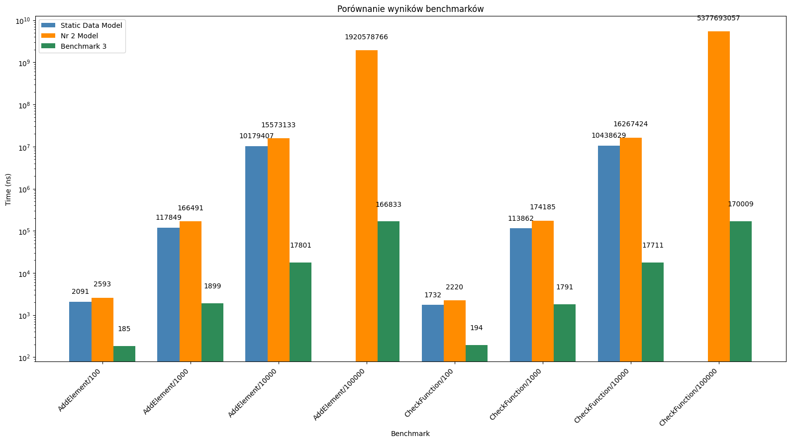

# Instrukcja
- Uruchomienie kodu testowego - run.sh
- Uruchomienie kodu testowego z valgrind - run_with_valgrind.sh
- Uruchomienie UT - run_test.sh
- Uruchomienie benchmarkow wymaga [Bazel](https://github.com/bazelbuild/bazelisk/releases/tag/v1.25.0) (wyniki benchmarkow na wykresie ponizej)

# Model nr 1:
### Model na statycznej tablicy, zapisany w kolejności dodawania, model referencyjny nie dodany do repozytorium
- statyczna pamięć
- brak sortowania
- kazdorazowe przeliczanie masek
- złożoność O(n^2)

# Model nr 2:
### Model na dynamicznej pamięci, sortowany po masce malejąco, lookup table dla maski
- dynamiczna pamięć w postaci listy
- sortowanie po długości maski
- złożoność O(n^2)
- lookup table dla maski

# Model nr 3 ( Docelowy ):
### Model przechowujący adres sieci jako drzewo binarne, lookup table dla maski
- zmiana struktury na drzewo binarne
- lookup table dla maski
- złożoność O(n)

